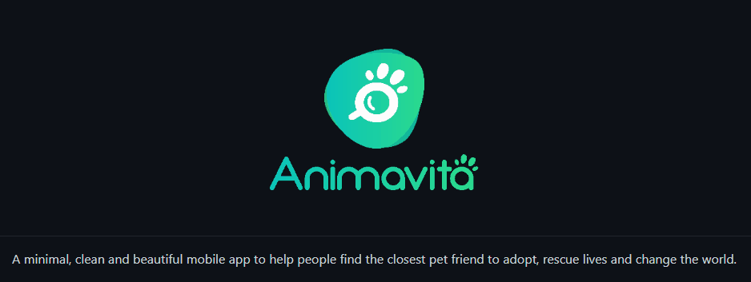

# Projeto com README 

Um projeto com arquivo readme 🚀
[](https://google.com)
 
 ## tecnilogias utilizadas
 - HTML
 - CSS
 - JS

 ## como utilizar
 1 - clone o projeto
 ```
 git clone <url>
 ```
 2 - acesse a pasta do projeto
 ```
 cd repositorio-com-readme
 ```


